# Version Control and Git Workflow Management
### JJAdams Empire and Associates | IT Portfolio
**Jubril Adams** | AZ-104 | CompTIA Cloud+ | Network+ | Security+

## Project Overview

Implemented a complete Git-based version control workflow simulating 
a real-world consulting engagement. Managed a multi-branch repository 
using GitLab, resolved merge conflicts, applied semantic versioning, 
and maintained professional documentation throughout the development 
lifecycle.

## Business Scenario

Engaged as an IT consultant for a web development firm requiring 
version-controlled management of their company website source files. 
Multiple consultants working concurrently required disciplined 
branching strategy, commit hygiene, and conflict resolution 
procedures to protect code integrity.

## Technical Skills Demonstrated

- Git CLI proficiency (clone, branch, commit, merge, push, tag)
- Branch strategy design (main, Working, Test)
- Merge conflict identification and manual resolution
- Semantic versioning with Git tags (V.1.0.0)
- Remote repository management via GitLab
- HTML debugging and code quality improvement
- Technical documentation and retrospective writing

## Tools and Technologies

| Tool | Purpose |
|---|---|
| Git 2.54 | Version control engine |
| GitLab | Remote repository hosting |
| Git Bash | Command line interface on Windows |
| HTML | Website source file modification |
| Notepad | Text editing for code changes |

## Workflow Architecture
main

└── Working (primary development branch)

├── Commit 1: Fix title tag, correct spelling errors in index.html

├── Commit 2: Fix title tag, correct spelling errors in about.html

├── Commit 3: Fix title tag, broken tag, spelling errors in services.html

├── Merge: Resolved conflict between Working and Test branches

└── Tag: V.1.0.0

└── Test (feature branch)

└── Commit: Add student ID to README

## Project Phases

### Phase 1: Repository Setup
Forked the GitLab template repository and created a dedicated 
Working branch to isolate development from the main production 
branch. Cloned the remote repository to local machine using Git CLI.

### Phase 2: HTML Code Improvements
Identified and corrected multiple issues across three HTML files 
on the Working branch including broken tags, spelling errors, and 
outdated page titles. Each file was committed separately with 
descriptive commit messages following best practices.

**index.html changes:**
- Updated page title from placeholder to production value
- Fixed spelling error in web development description
- Fixed spelling error in services section

**about.html changes:**
- Updated page title to match site branding
- Fixed spelling error in staffing section
- Fixed double spacing and spelling in training section

**services.html changes:**
- Updated page title to match site branding
- Fixed broken HTML closing tag in responsive section
- Fixed two spelling errors in e-commerce section

### Phase 3: Feature Branch and Merge Conflict
Created a Test branch from Working to simulate concurrent 
development. Added identifying information to README.md on both 
branches intentionally targeting the same file region to produce 
a merge conflict. Resolved the conflict manually by editing the 
conflict markers and preserving both sets of changes before 
committing the resolution.

### Phase 4: Semantic Versioning
Applied a Git tag of V.1.0.0 to the Working branch to mark the 
first stable release of the project, then pushed the tag to the 
remote GitLab repository.

### Phase 5: Retrospective Documentation
Created a structured retrospective directory containing:
- git log output redirected to log.txt
- Written summary of conflict resolution and code changes
- Full screenshot documentation of all workflow phases

## Key Results

- Zero data loss during merge conflict resolution
- All three HTML files improved with meaningful documented changes
- Clean commit history with descriptive messages across all branches
- Semantic version tag successfully applied and visible in repository graph
- Complete retrospective documentation pushed to remote repository

## What This Demonstrates to Employers

1. Working independently in a version-controlled environment
2. Following branching conventions used in real development teams
3. Identifying and resolving merge conflicts without losing work
4. Writing clear commit messages that communicate change intent
5. Applying versioning standards for release management
6. Documenting work professionally for handoff and audit purposes

These are daily skills required in IT Support, Systems 
Administration, Cloud Engineering, and DevOps roles.

## Screenshots

### Part A - Working Branch Created
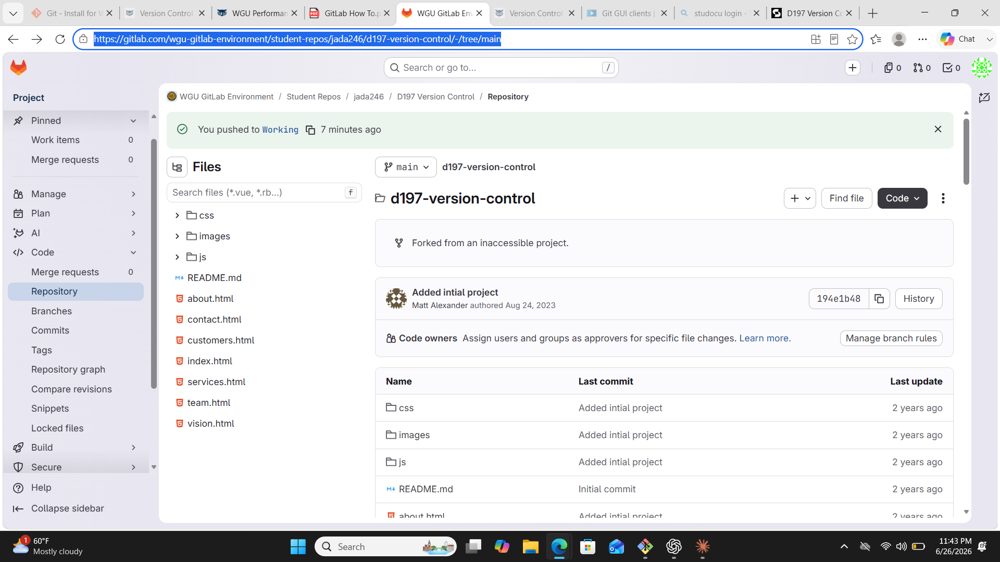
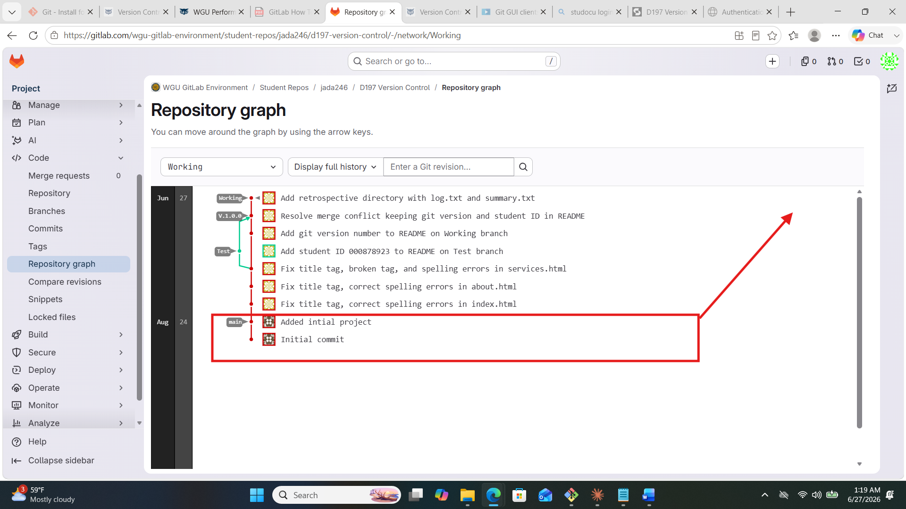

### Part B - Repository Cloned Successfully
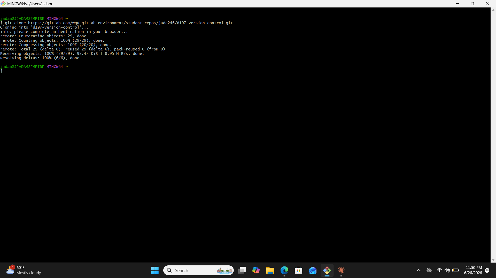

### Part C - HTML File Commits on Working Branch
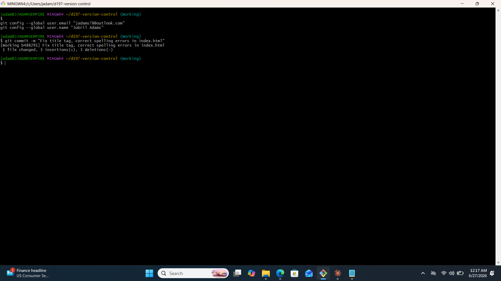

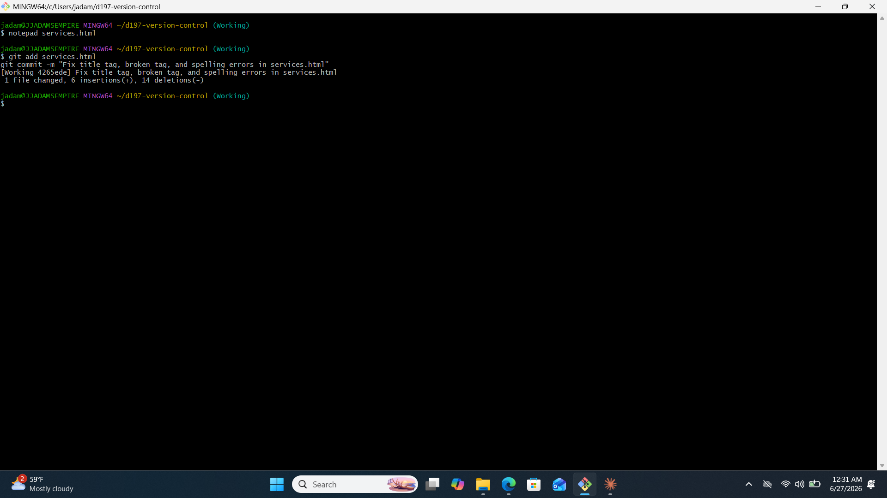
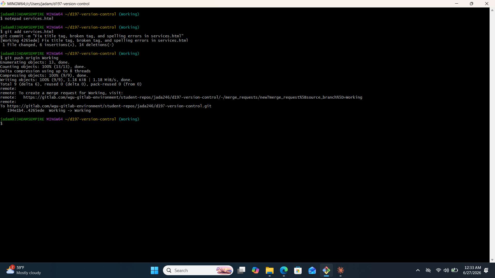

### Part D - Test Branch Created and Pushed
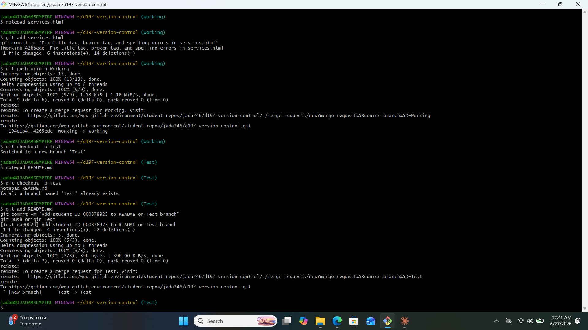
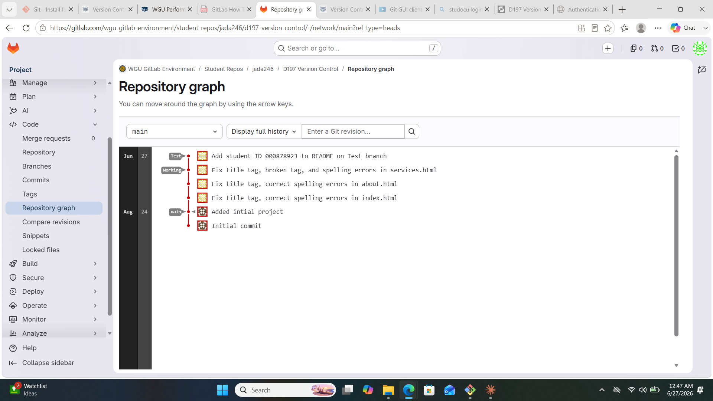

### Part E - Merge Conflict and Resolution
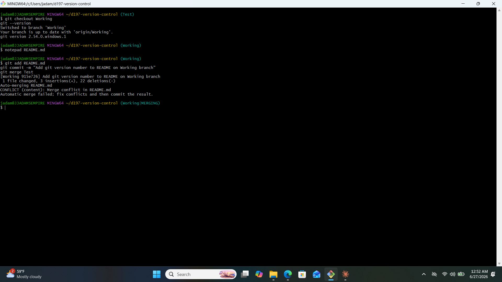
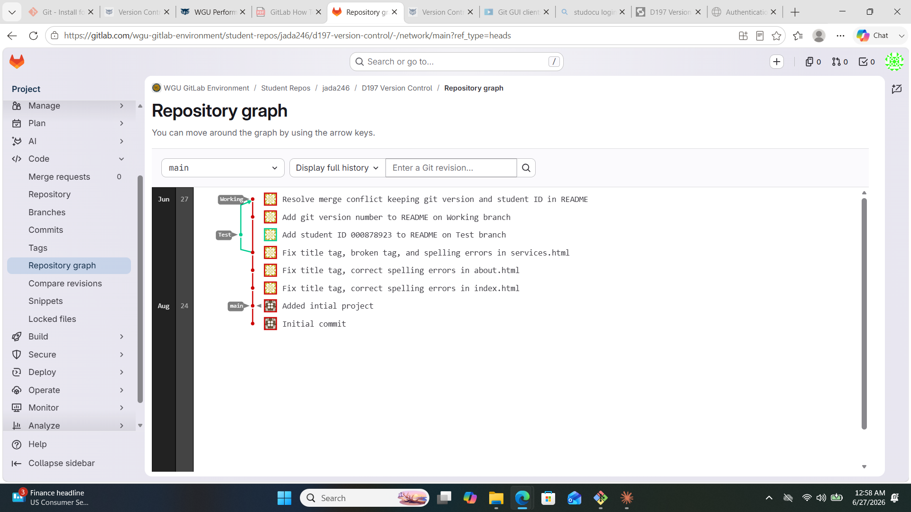

### Part F - Version Tag Applied
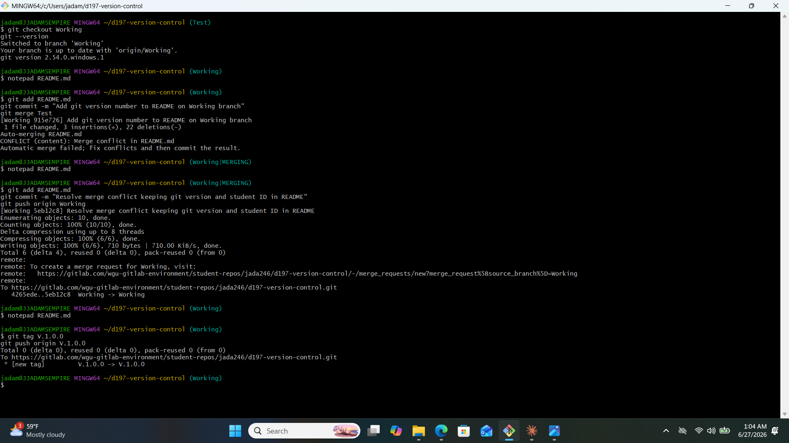
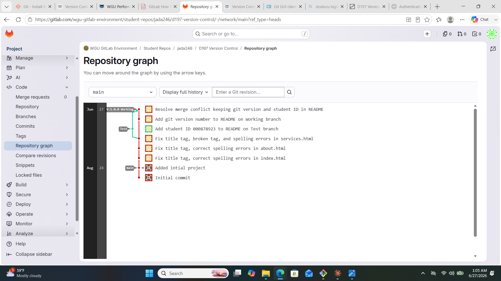

## Live Repository

GitLab:
https://gitlab.com/wgu-gitlab-environment/student-repos/jada246/d197-version-control

## Connect

Portfolio: https://jubriladams78.github.io
LinkedIn: linkedin.com/in/jubriladams78

---
*Jubril Adams | JJAdams Empire and Associates*